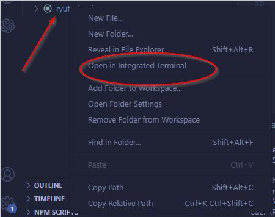
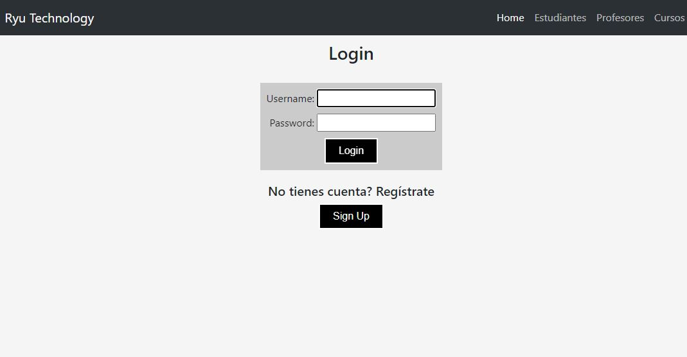
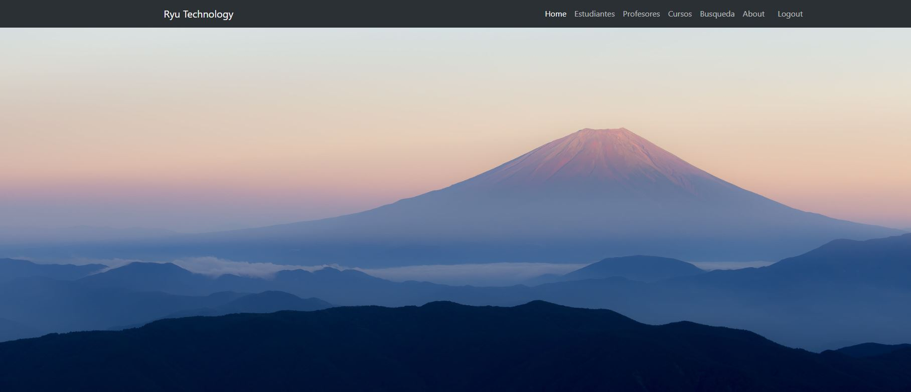
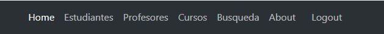
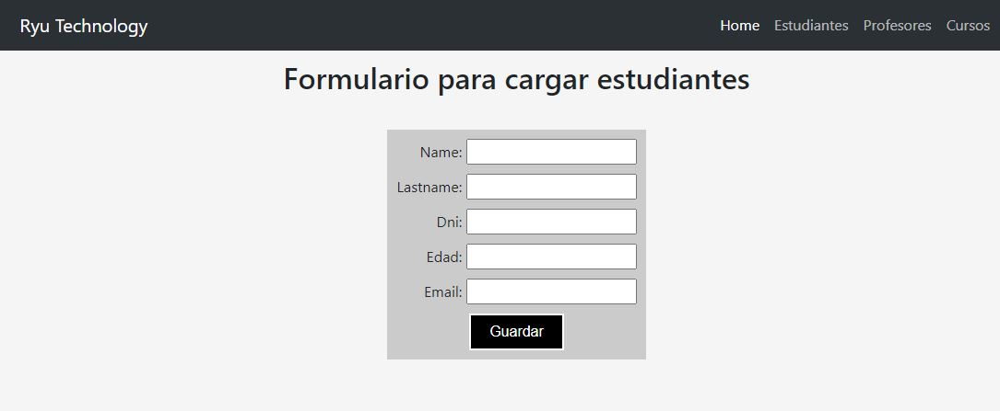
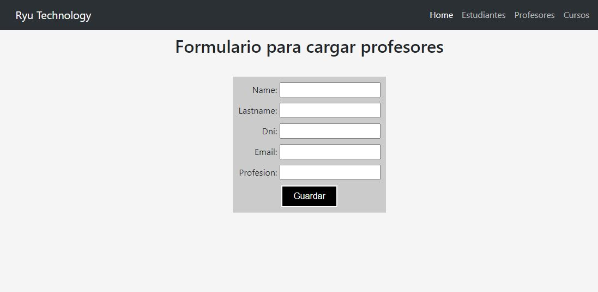
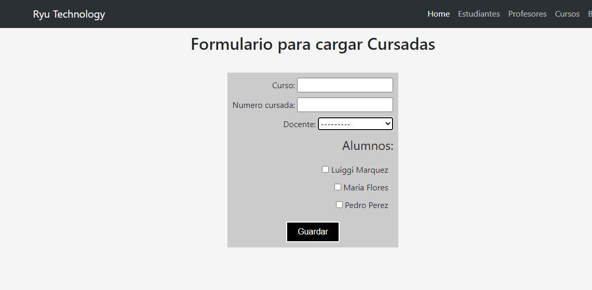
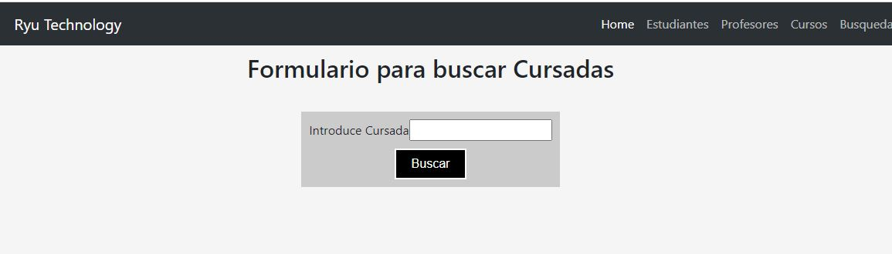
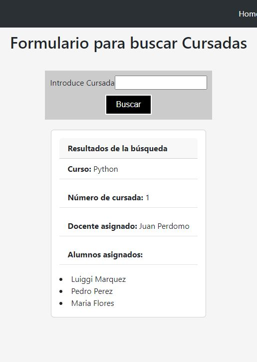

# Ryu Technology

Este site desarrllado para este proyecto es una pequeña aplicación para salvar los cursos de un sistema educativo, consiste en registro de estudiantes, de profesores, de cursos y la asignación almunos y docentes a los cursos; incluye un sistema de búsqueda de los cursos donde da como respuesta la información de los miembros que pertenecen a éste.


## Comenzando 🚀

Este es un proyecto público, puedes decargarte una copia desde la pestaña code o haciendo un Clone 😊

Mira [aquí](https://github.com/luiggimarquez/Ryu_tech-Python/tree/Pre-entrega_3) 

El proyecto está formado por las páginas:  index, estudiantes, cursos, profesores y busqueda, junto a las de login y registro.

El archivo principal de estilos es style.css, ubicado en el folder **App_1/static/css**.

Algunos componentes están sacados de boostrap, éste además formatea muchos de los estilos del proyecto de forma automática.

### Pre-requisitos 📋

Se necesita tener instalado Python 🐍: [descargar](https://www.python.org/downloads/) (importante seleccionar añadir Python al Path en Windows) 

Se trabajó en un entorno virtual, por lo que librerías se cargan con el archivo **requirements.txt**. Debes tener instalado algún entorno virtual, en el proyecto se usó VirtualEnv

Puedes utilizar Visual Studio Code o Sublime Text para revisarlo 🔧

### Instalación 🔧 👨‍💻

Estas instrucciones están hechas para **Visual Studio Code**, con el cual lo realicé:

* Instalar si hace falta, Python 🐍.

* Instalar VirtualEnv (En consola instalar con `pip install virtualenv`, en Mac escribir `pip3 install virtualenv`)

* Para clonar el repositorio de github del proyecto, copiamos el URL en Github.


* En Visual Studio, crear una carpeta y hacer click derecho -> 



Esto nos ubica en la carpeta creada para el proyecto en el terminal

* Escribir del comando `git clone`, pegar el URL del repositorio después  y presionar enter, esto nos crea una carpeta del proyecto llamada **Ryu-Tech-Python**. En el terminal escribimos `cd Ryu-Tech-Python` para entrar en el root del proyecto.

* Crear un entorno virtual entrando en la consola/terminal: ´py -m venv venv´ en Windows; para Mac escribir `python3 -m venv venv`

* Activar el entorno virtual creado con: `.\venv\Scripts\activate` para windows, para Mac usar `source venv/bin/activate` (si da access denied elevar con SUDO) 

* Instalar los paquetes/librerías usados en el proyecto con: `pip install -r "requirements.txt"` 

* Estando ubicados en el root del proyecto (Ryu_tech-Python/) Compila con `py manage.py runserver` en windows, en Mac con ` python3 manage.py runserver`  


Ya podemos acceder en el navegador con el localhost o http://127.0.0.1:8000/ . En caso de tener el puerto ocuado, se puede ejecutar con `py manage.py runserver XXXX` donde XXXX es el puerto que se desee usar


## Construido con 🛠️


* El código está hecho directamente con 🐍 python V 3.11.2 desarollado en Visual Studio Code 1.74.3

* Se uso principalmente el framework Django V 4.1

* Las imágenes no son de mi autoría, todo es material público en internet.

* El layout del frontend está hecho con flexbox  y desarrollado algunos componentes con boostrap 5.3.

* Se usó virtualenv como entorno virtual

* El DB usado es el SQLite proporcionado por Django


## Resumen del proyecto 📜
#

Este Proyecto backend está estructurado en la  arquitectura MVT (Model-View-Template)

Posee una aplicacion llamada **App_1** donde se desarolla toda la programación:

>URLS

En nuestro folder principal **Preentrega_3**, desde **urls.py** incluimos todas las rutas usadas en la aplicación a través de **path("", include('App_1.urls'))**

Nuestras rutas principales están contenidas en App_1.urls.py y son las siguientes:

* `/` nos dirige al home (index.html) del sitio.
* `Signup/` nos dirige a la página de registro de usuario.
* `login/` permite iniciar sesión.
* `logout/` permite cerrar sesión.
* `estudiantes/` nos dirige al formulario para agregar estudiantes.
* `profesores/` nos dirige al formulario para agregar docentes.
* `cursos/` nos dirige al formulario para crear cursadas/materias/cursos.
* `busqueda/` permite buscar las cursadas existentes y mostrar los miembros.
* `admin/` permite entrar al ambiente de administración.

Todas las páginas están restringidas al login a través del decorador **@login_required** (`django.contrib.auth.decorators`), que obliga a estar logueado para navegar en los recursos, así que se debe iniciar sesión para acceder al contenido. Todos los sitios redirigen al **login/** y desde aquí se puede iniciar sesión o ir a la página **signup/** para registrar un nuevo usuario y poder acceder a toda la página.

>Views

Todos los views se encuentrar en la app **App_1** en **views.py**.

*`base`: Esta función es el **home**. En este se carga el index.html que contiene los layouts básicos del sitio: navbar, footer, links a las otras funcionalidades y tiene una imagen Hero solo para decorar.

*`singup`: Esta función tiene la logica del registro de usuarios. En primer lugar hace una validación si hay un usuario logueado (si hay alguien logueado lo lógico es que no se pueda registrar un nuevo usuario) asi que mediante `request.user.is_authenticated` se valida esto: si hay un usuario activo se redirige a **Home**, si no, se ejecuta la lógica.

Trabaja de la siguiente forma: se valida que método se está recibiendo, GET o POST; si es GET significa que se está cargando la página y renderiza a **singUp.HMTL**, enviandole un diccionario con el form proveniente de **django.contrib.auth.forms** , este es **UserCreationForm** que ya nos da la funcionalidad en Django para crear un usuario. Si por el contrario se recibe un metodo POST, es decir, se enviaron datos desde la página a través del formulario, primero se verifica con un **if** si los dos password son iguales (el form UserCreationForm incluye un input para confirmar el password), si son diferentes se envía un mensaje de error en el renderizado del la página **signup.html** para informar que los passwords no coinciden, si todo sale bien, se almacena en la base datos (**save()**), se ejecuta el login con **login()** proporcionado por **django.contrib.auth** y redirige a **home** con el usuario ya logueado (una cookie con los datos del login).


*`log_out`: esta función llama a **logout()** que es proporcionado por **django.contrib.auth** para cerrar la sesión del usuario: elimina la cookie y se redirige a **Home**

*`log_in`: valida si ya hay un usuario logueado en primer lugar, si lo hay redirige a **home**; si no hay, valida el método que se está recibiendo: si es GET renderiza la vista del login **login.html** enviándole un formulario nativo de django para la autenticación (`AuthenticationForm` de **django.contrib.auth.forms**); si el método recibido es POST, se usa **authenticate()** para validar los datos enviados: si no hay usuario nos devuelve vacío; De ser vacío rederizamos otra vez la vista de **login.html** adjuntandole un error de login, si no es vacío la respuesta de **authenticate**, usamos el metodo login() para validar el usuario y hacer el login.

*`estudiantes`: esta función renderiza el formulario para agregar estudiantes a la base de datos; si es un método GET, nos renderiza el archivo **estudiantes.html** con el formulario adjunto. si es POST, primero valida la info proveniente del frontend con `ìs_valid()`, esto filtrará tipos erróneos de datos o datos únicos que están repetidos (DNI, Mail y número de cursada están configurados como **unique** en los modelos, deben ser únicos) si los datos están bien, se guardan en la DB y se envía mensaje al frontend; si los datos tuvieron algún problema se renderiza el **estudiantes.html** indicando que hay un error. Está configurado para que regrese a la misma página este bien el dato o no.

*`profesores`: al igual que **estudiantes** la función profesores válida primero la integridad de los datos, si están bien los almacena en la base de datos y envía un aviso al frontend, si está mal envia un mensaje a frontend indicado que se produjo un error.

*`cursos`: cuando esta función recibe un método GET, renderiza el **cursos.html** con su formulario. El método POST toma como necesario el nombre y numero de cursada, los otros campos se puede quedar en blanco, los **profesores** es una relación OnetoOne como foreigkey de cursos, y los estudiantes son una relación ManytoMany con **cursos**, así de esta forma podemos asignar a las cursadas profesores y estudiantes ya registrados; fueron configurados los campos de estudiantes y profesores como **blank** por si no están disponibles a la hora de crearse. Luego se pueden asignar en el panel de administración. Los datos al llegar del frontend se evaluan con `is_valid()`, si están bien, se graban con `save()` y con `save_m2m()` y se renderiza de nuevo **cursos.HTML** con un mensaje de confirmación. Si hay error, se renderiza pero con un mensaje de error.

*`busqueda`: las consultas se realizan mediante el método GET, asi que esta función lo primero que evalua es que esté vacío, si es así solo renderiza **busqueda.html**. Para consultar, se usa solamente el número de cursada; con el dato recibo del frontend, con request.GET consultamos con `filter` en la base de datos, si es vacío enviaremos un flag llamado empty al frontend como mensaje que el dato consultado no existe; si la consulta al DB arroja resultado, enviamos el dato adjunto en la renderizado de **busqueda.html**. Se usó un try/except para capturar cuando el dato se reciba en blanco o el dato que se envíe no sea tipo **int** 

>Models

Se utilizaron 3 modelos para almacenar en la base de datos, tienen el siguiente formato:

Cursos: 

```
class Curso (models.Model):
   
    curso = models.CharField(max_length=100)
    numero_cursada = models.IntegerField(unique=True)
    docente = models.ForeignKey(Profesores, null=True, blank=True, on_delete=models.CASCADE)
    alumnos = models.ManyToManyField(Estudiantes, blank=True)

```
Estudiantes
```
class Estudiantes (models.Model):
    name = models.CharField(max_length=100)
    lastname = models.CharField(max_length=100)
    dni = models.IntegerField(unique=True)
    edad = models.IntegerField() 
    email = models.EmailField(max_length=100, unique=True)

```

Profesores

```
class Profesores (models.Model):
    name = models.CharField(max_length=100)
    lastname = models.CharField(max_length=100)
    dni = models.IntegerField(unique=True)
    email= models.EmailField(max_length=100, unique=True)
    profesion = models.CharField(max_length=100)

```

Aquí se definieron DNI, Mails y número de cursada como atributo **unique** para que no se permita en la DB otro dato igual (ningún alumno puede tener el mismo DNI, ningún profesor puede tener el mismo DNI, las cursadas tiene un número único)

>forms

Para los formularios se usó una clase de Django llamada ModelForm de **django.form** para cargar los formularios que se usaron en los HTML con los datos que existen en cada modelo en **models.py**, por eso en las funciones de los views.py se añaden a los renderizados de los HTML las clases de estos forms generados aquí. Se hacen a partir de los modelos:

EstudiantesForm

```
class EstudiantesForm(ModelForm):
    class Meta:
        model = Estudiantes
        fields =['name','lastname', 'dni', 'edad', 'email']

```
ProfesoresForm

```

class ProfesoresForm(ModelForm):
    class Meta:
        model = Profesores
        fields = ['name','lastname', 'dni','email','profesion' ]

```

CursosForm

```
class CursosForm(ModelForm):
    alumnos = forms.ModelMultipleChoiceField(
                        queryset=Estudiantes.objects.all().order_by('name'),
                        widget=forms.CheckboxSelectMultiple,required=False)
    class Meta:
        model = Curso
        fields = ['curso','numero_cursada', 'docente','alumnos']

```

## Funcionamiento 📜
#

Hay dos usuarios **superadmin**:

```
* usuario: luiggi_marquez
* password: Luiggi123

* usuario: admin
* password: Admin123

```
Con esto podemos entrar al panel de administración si hace falta. También podemos iniciar sesión para la aplicación web; se pueden registrar nuevos usuarios, pero estos no tienen acceso al panel de administración.



Podemos iniciar sesión con estos usuarios o crear uno nuevo en **signup**. Todos los vínculos están protegidos y al no tener usuario logueado redireccionan al login.html (excepto singup.html y el panel de administración)

**home** solo contiene un Hero, una sección about y los vínculos para navegar en el sitio



el navbar contiene al final el link para hacer **logout**



**Estudiantes**

Aquí podemos agregar estudiantes en el formulario:



**Profesores**

Aquí agregamos profesores con el formulario:



**Cursos**

Aquí agregaremos las cursadas:



**Busquedas**

Las busquedas se realizan por el número de las cursadas:



Al encontrar una se despliega debajo un card con los resultados



Estan registradas cursadas 1, 2 y 3


>Otros datos

* Se usó herancia de templates, teniendo como base index.HTML y en los demás HTML se uso jinja2 para heredar navbar, footers, vínculos y para validaciones como **if** y ciclo **for**

* En App_1 esta el folder **static** que contiene el archivo css y las imágenes usadas en el favicon, readme y el Hero de la página Home.

* Se deja el archivo **requirements.txt** para replicar el entorno virtual

* Se añadieron a admin.py de App_1 los modelos para que aparezcan en el panel de administracion y puedan ser editados desde ahí.

* En setting de Preentrega_3 folder, se añadió ]`LOGIN_URL = "login"` para que las rutas protegidas se redirijan a **login** si no hay sesión 

## Autor✒️

Este proyecto fue realizado para las clases de Python de CoderHouse por:

**Ing. Luiggi Márquez** - [GitHub Profile](https://github.com/luiggimarquez) ✌️

Buenos Aires, Argentina 2023
