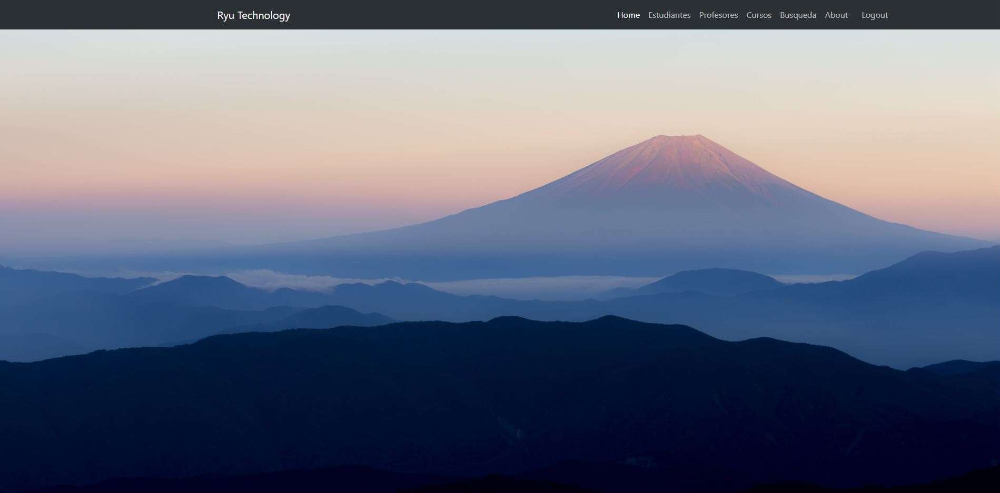

# Ryu Technology

Este site desarrllado para este proyecto es una pequeña aplicación para salvar los cursos de un sistema educativo, consiste en registro de estudiantes, de profesores, de cursos y la asignacion almunos y docentes al los cursos; incluye un sistema de busqueda de los cursos donde da la informacion de los miembros que pertenecen a este.

## Comenzando 🚀

Este es un proyecto público, puedes decargarte una copia desde la pestaña code o haciendo un Clone 😊

Mira [aquí](https://luiggimarquez.github.io/Ryutechnology_V2/) para conocer como luce el proyecto o en **Deployment**

El proyecto está formado por 4 páginas:  index, productos, factura y contacto.

El archivo principal de SASS es estilos.scss, desde éste se llaman mediante partials a las otras
hojas.

El SASS compila del archivos estilos.scss de la carpeta SCSS, en el archivo styles.css en la
carpeta CSS (ver archivo package.json)

Los archivos Javascript están en la carpeta JS, que se encuentra organizada asi:

    > JS folder: contiene los archivos principales:
        - main.js: carga los archivos desde un JSON local
        - app.js: llama a la función encargada de armar los productos en el inicio del DOM
        - cargaProductos.js: escribe en el DOM los productos del e-commerce.
    
    > Components folder: contiene los componentes de los archivos javascript usados para elaborar la lógica del funcionamiento:
        - cart: posee todos los componentes usados para el desarrollo del carrito de compras (su lógica)
        - invoice: tiene la lógica para imprimir en elementos HTML la info de la factura
        - menu: este folder contiene todos los componentes usados para los accesos y menus del sitio, como el modal del carrito,
        los menus burguer del responsive, el menu de busqueda, el menu del filtrado, el slider de imagen y el tab del index.

    > Data folder: contiene el JSON que cumple la función de base datos del sitio.

### Pre-requisitos 📋

Para poder usar los SCSS, es necesario tener instalado node.js y tener instalado nodemon.
Puedes utilizar Visual Studio Code o Sublime Text para revisarlo 🔧

### Instalación 

Estas instrucciones están hechas para **Visual Studio Code**, con el cual lo realicé:

* Instala **node.js** y **npm** desde https://nodejs.org/es/download/

* En el Visual Studio Code úbicate en el directorio del proyecto

* Inicia el `npm`, con `npm init` en TERMINAL (Ctrl + ñ)

* Instala el **nodemon** con: `npm install -D node-sass nodemon`

* Compila con `npm run watch-css`

Si ya tienes instalado el node.js, ya están incluidos los files package.json y los .scss, puedes editar directamente los .scss 😊
y solamente compilar el proyecto para comenzar.

## Construido con 🛠️

* El código está hecho directamente python desarollado en Visual Studio Code 1.74.3

* Se uso principalmente el framework Django 4.1

* Las imágenes no son de mi autoría, todo es material público en internet.

* El layout del frontend está hecho con flexbox  y desarrollado algunos componentes con boostrap 5.3.

* Se usó virtualenv como entorno virtual

* El DB usado es el SQLite proporcionado por Django

## Autor✒️

Este proyecto fue realizado para las clases de Python de CoderHouse por:

**Ing. Luiggi Márquez** - [GitHub Profile](https://github.com/luiggimarquez) ✌️

Buenos Aires, Argentina 2023
